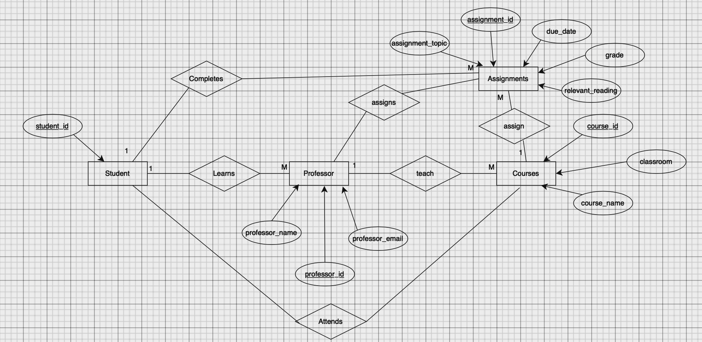

# Assignment 5 Database Design -- Marianna Nibu

## Original Data Set
| assignment_id | student_id | due_date | professor | assignment_topic                | classroom | grade | relevant_reading    | professor_email   |
| :------------ | :--------- | :------- | :-------- | :------------------------------ | :-------- | :---- | :------------------ | :---------------- |
| 1             | 1          | 23.02.21 | Melvin    | Data normalization              | WWH 101   | 80    | Deumlich Chapter 3  | l.melvin@foo.edu  |
| 2             | 7          | 18.11.21 | Logston   | Single table queries            | 60FA 314  | 25    | Dümmlers Chapter 11 | e.logston@foo.edu |
| 1             | 4          | 23.02.21 | Melvin    | Data normalization              | WWH 101   | 75    | Deumlich Chapter 3  | l.melvin@foo.edu  |
| 5             | 2          | 05.05.21 | Logston   | Python and pandas               | 60FA 314  | 92    | Dümmlers Chapter 14 | e.logston@foo.edu |
| 4             | 2          | 04.07.21 | Nevarez   | Spreadsheet aggregate functions | WWH 201   | 65    | Zehnder Page 87     | i.nevarez@foo.edu |
| ...           | ...        | ...      | ...       | ...                             | ...       | ...   | ...                 | ...               |

Here is the original data set, representing students' grades in courses at a university. This table is 1NF-compliant as all the occurrences of a record type contain the same number of fields. However, this table is not 4NF-compliant for multiple reasons. First, this table contains multi-valued facts. For example, "relevant_reading" depends on "assignment_topic," which depends on "professor." Second, this table also contains redundant data, specifically when it comes to the "assignment_topic," "due_date," "relevant_reading," etc. This data is repeated for the different student_id's that are enrolled in the same courses with the same assignments. If one assignment needs to be updated, for example the relevant_reading needs to be changed, then you would have to change every record referring to that specific assignment. With this table, normalization is not achieved, making it easier for anomalies and data inconsistencies to occur. 

In order to make this data set 4NF-compliant, there need to be several new tables made, splitting up the information in a logical manner. 

## Tables Containing 4NF-compliant Version of the data set 

### Table 1: Professors 
|professor_id | professor_name | professor_email |
|:----------| :-------------- | :--------------|
| 1  | Melvin | l.melvin@foo.edu|
| 2  | Logston | e.logston@foo.edu|
| 3  | Nevarez | i.nevarez@foo.edu|
| ... | ... | ... |

### Table 2: Courses
| course_id | course_name |
| :---------| :-----------|
| 1 | Data Analysis |
| 2 | Database Design |
| 3 | Intro to Data Normalization |
| 4 | Intro to Spreadsheets | 
| ... | ... |

### Table 3: Students 
|student_id | course_id |
| :---------| :-----------|
| 1 | 3 |
| 7 | 1 |
| 4 | 3 |
| 2 | 2 |
| 2 | 4 |
| ... | ... |

### Table 4: Assignments 
assignment_id | course_id | professor_id | assignment_topic | due_date| classroom |
| :---------| :--------| :------| :---- |:---------| :----- |
|  1 | 3 |  1 | Data normalization | 23.02.21 | WWH101 |
|  2 | 1 | 2 | Single table queries | 18.11.21 | 60FA 314 |
|  5 | 2 | 2 | Python and pandas | 05.05.21 | 60FA 314 |
|  4 | 4 | 3 | Spreadsheet aggregate functions | 04.07.21 | WWH201 |
| ... | ... | ... | ... | ... | ... |

### Table 5: Grades
| student_id | assignment_id | grade |
| :---------| :--------| :------|
| 1 |  1 | 80|
| 7 | 2 | 25 |
| 4 |  1 | 75 |
| 2 |  5 | 92 |
| 2 |  4 | 65 |
| ... | ... | ... |

### Table 6: Readings 
reading_id | assignment_id | relevant_reading |
| :---------| :--------| :------|
| 1 |  1 | Deumlich Chapter 3 |
| 2 |  2 | Dümmlers Chapter 11 |
| 3 |  5 | Dümmlers Chapter 14 |
| 4 | 4  | Zehnder Page 87 |
| ... | ... | ... |

Here are the tables that I created that fit the 4NF requirements. The first table that I created represents information about the professors. I created a professor_id key, with the professor_name and the professor_email. This now keeps all the information about the professors within one table. 
The second table that I created represents the information about the courses. I created a course_id key, and course_name for the names of all the courses. 
The third table that I created is about the students and what course they are enrolled in. This table utilizes the student_id and course_id. 
The fourth table that I created is about the assignments that the students receive. This table displays the assignment_id, corresponding course_id, professor_id, assignment_topic, due_date and the classroom. These are all attributes that all directly to the assignment_id key.
The fifth table that I created is for the grades that the students received. This table displays the student_id, assignment_id and corresponding grade. 
The last table that I made is about the readings that are assigned to the students for their specific assignments. This table displays the reading_id, assignment_id and relevant_reading. 
With these changes, the data is now 4NF compliant as the data is now represented only once instead of multiple times. Each table now has its own primary key field that identifies each record in a unique manner. There are clear relationships between the primary keys and their counterparts in the table. These are all requirements that have been met to achieve 4NF. 

## ER diagram  

Here is my ER diagram. I was having several issues importing it from draw.io, I kept getting an issue "Authorization Required" and no matter what I did to fix this issue, it wouldn't work. 

